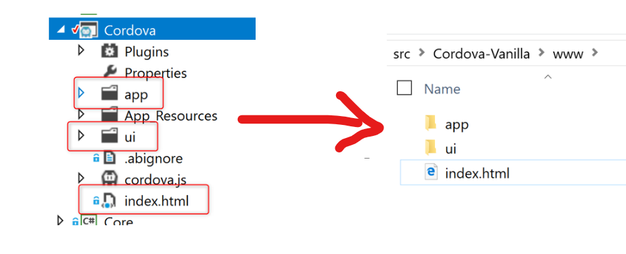

# Migration from Telerik AppBuilder to "Vanilla" Cordova building with VSTS
Telerik AppBuilder will be retired on the 10th May 2018. Therefore, all mobile projects relying on that pllatform will need to be migrated to a different platform.

This how-to covers the steps to migrate to "Vanilla" Cordova build via command line interface using Visual Studio Team Services (VSTS) to create the actual app packages.

If you have additional information please don't hesitate to improve the document and submit a PR!!

## Prelimiraries
* You have a working Telerik AppBuilder project
* Cordova is installed `npm install -g cordova`

## Create an empty Cordova project
Create a new Cordova project – ideally located parallel to the AppBuilder project.

```
cordova create hello com.example.hello HelloWorld 
```
More on creating a project can be found [here](https://cordova.apache.org/docs/en/latest/guide/cli/)

## Install the plugins
Locate the plugins in the .abproject file of the AppBuilder project.
The file content looks like below and the plugins are listed:
```
{
  "CorePlugins": [
    "cordova-plugin-network-information",
    "cordova-plugin-splashscreen",
  ]
}
```

Install the plugins in the new Cordova project
```
    cordova plugin add cordova-plugin-network-information
    cordova plugin add cordova-plugin-splashscreen
```

## Copy Web App to <cordova project>/www
Tweak your build pipeline to dump the web application into the new Cordova project's 'www' folder rather than into the AppBuilder project.




## Config.xml / build.json

***Config.xml***

config.xml contains all information about the Cordova project's configuration (plugins, plugin configurations, app entry point, etc.).
Make sure you specify you app entry point in case it is not 'www/index.html' which is the default.

More information about config.xml can be found [here](https://cordova.apache.org/docs/en/latest/config_ref/).


***build.json***

For iOS builds using VSTS you will need a `build.json` file to be present in the Cordova project folder containing information necesary for code signing, such as the provisioning profile ID, etc.
General information about building iOS can be found [here](https://cordova.apache.org/docs/en/latest/guide/platforms/ios/).

More specific information about `build.json` with regard to building for iOS on VSTS is [here](https://docs.microsoft.com/en-us/visualstudio/cross-platform/tools-for-cordova/first-steps/ios-guide#xcode8).

## Create build steps to build the apps in VSTS
In addition to you build steps that build the web app, create a "Cordova Build" step for iOS/Android. For iOS code signing, P12 certificate and provisioning profile can be checked into source control and can be specified in the iOS settings of the build step.
