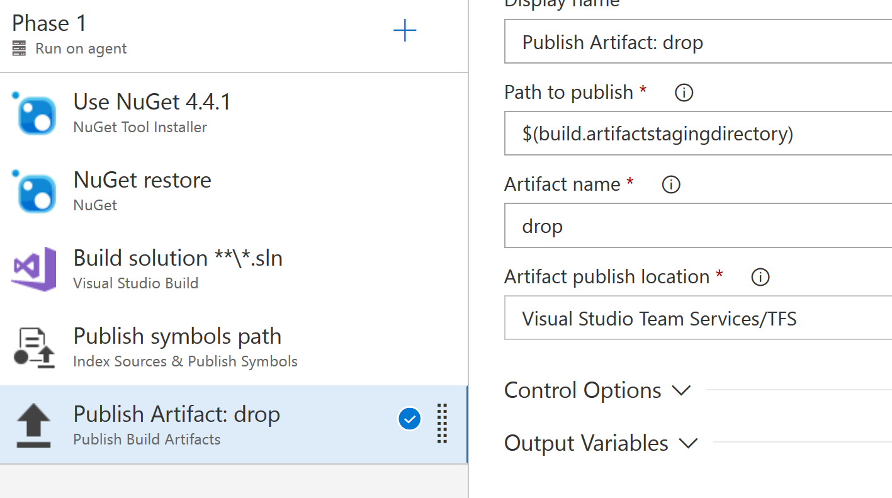
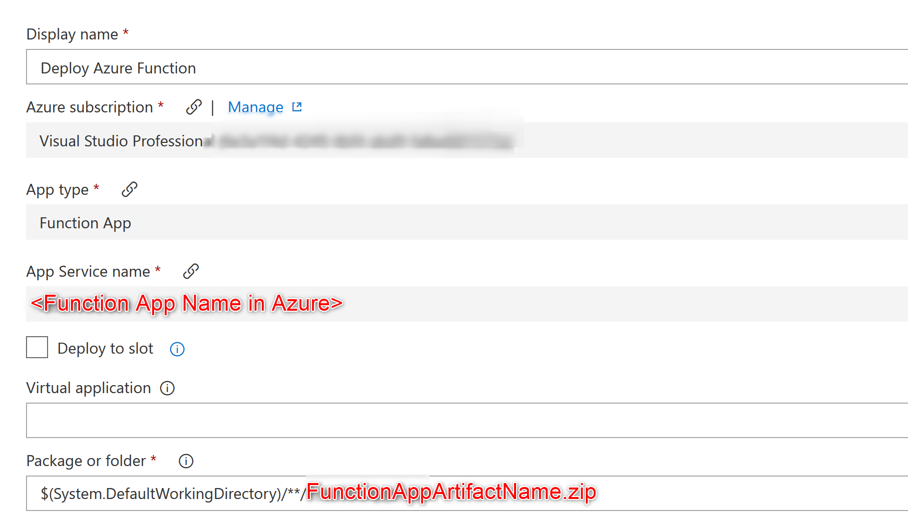
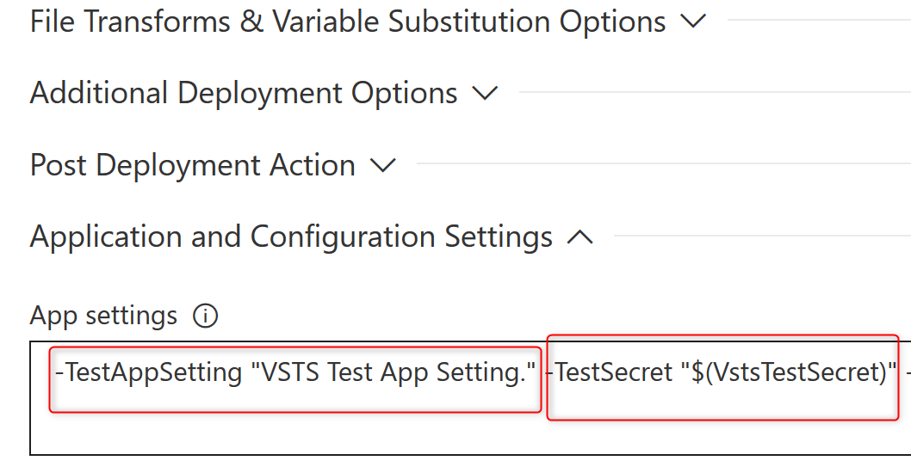

# Azure Functions - From Creation to Automated Deployment using VSTS
[Azure functions](https://azure.microsoft.com/en-gb/services/functions/) have been around for a while and they're pretty easy to [get started with in Visual Studio 2017](https://docs.microsoft.com/en-us/azure/azure-functions/functions-create-your-first-function-visual-studio). Local development is pretty easy and it is a solid F5 experience.

# Deployment to Azure using VSTS
Azure functions have one speciality that distinguish them from i.e. console apps or web apps - the lack of a configuration file that gets deployed and can be used to specify app settings. There is a `local.settings.json` that can be used for local development but it [will not get published to Azure by design](https://blogs.msdn.microsoft.com/webdev/2017/11/15/improvements-to-azure-functions-in-visual-studio/#ManageApplicationSettings).

App settings can be specified within the Azure Portal directly on the function app, but that's not really helpful when you have a deployment pipeline with a handful of different environments that your Function app will be deployed to unless you'd like to get in and add/change config-variables by hand everytime something changes. I found this a bit disappointing when I first found out about it. Luckily, app settings can be specified as part of the deployment in VSTS as we will see.

## How it works
1. [Create a new Function App](https://docs.microsoft.com/en-us/azure/azure-functions/functions-create-first-azure-function) in the Azure Portal.
2. [Create a new function app](https://docs.microsoft.com/en-us/azure/azure-functions/functions-create-your-first-function-visual-studio) in Visual Studio and check the source code into VSTS. 
4. [Create a build definition](https://docs.microsoft.com/en-us/vsts/pipelines/get-started-designer?view=vsts#create-a-build-pipeline) for your Function app.
    -  make sure to publish the function app artifact

        
5. [Create a release pipeline](https://docs.microsoft.com/en-us/vsts/pipelines/get-started-designer?view=vsts#create-a-release-pipeline) in VSTS
    - Use the artifact of the build definition above
    - Within the tasks of each environment, add a step `Azure App Service Deploy` to deploy the function to a Function App in Azure
    - configure the step to deploy to the Azure function app created in step 1.
    
6. Configure AppSettings
    - app settings can be configured using the notation `-<SETTING-NAME> "<SETTING-VALUE>"`
    - it's also possible to use variables i.e.  `-<SETTING-NAME> "$(<VARIABLE-NAME>)"` which enables you to specify environment-specific values.

        
